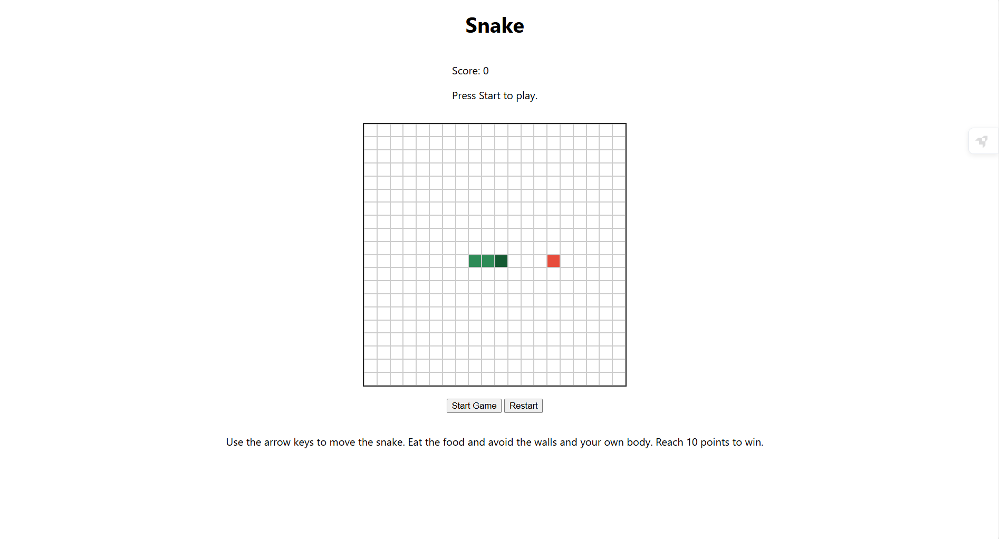

# Snake Game



A browser-based Snake game built with HTML, CSS, and JavaScript. Guide the snake around the board, collect food, and reach the target score without hitting a wall or the snake’s own body.

## Getting Started

Play the game: [Snake Game](https://cempo2001.github.io/snake-game/)

Click **Start Game** and use the arrow keys to move the snake. Eat food, avoid the walls and your own body, and reach 10 points to win.

## How to Play

1. Click **Start** to begin the game.
2. Use the arrow keys to control the snake.
3. Collect food to earn points.
4. Avoid hitting the walls or the snake’s own body.
5. Reach **10 points** to win.

## Features

- A 20 × 20 game board.
- Keyboard controls using the arrow keys.
- Food appears in an unoccupied cell.
- The score increases when the snake eats food.
- The game ends if the snake hits a wall or itself.
- The player wins after reaching 10 points.

## Project Structure

- `index.html` — the page structure and game elements.
- `css/style.css` — the page layout and game board styling, using Flexbox.
- `js/data.js` — game settings and starting positions for the snake and food.
- `js/app.js` — game state, board rendering, movement, keyboard controls, scoring, and win/loss logic.
- `planning.md` — the project plan and pseudocode.
- `assets/` — images and other game resources.

```text
snake-game/
├── assets/
│   └── .gitkeep
├── css/
│   └── style.css
├── js/
│   ├── app.js
│   └── data.js
├── index.html
├── planning.md
└── README.md
```

## Technologies Used

- HTML
- CSS
- JavaScript
- DOM manipulation
- CSS Flexbox

## Planning Materials

See [`planning.md`](./planning.md) for the project plan and pseudocode.

## Attributions

No external images, libraries, or other assets are currently used.

## Next Steps

- Improve the appearance of the snake, food, and background.
- Add sound effects or a win animation.
- Save the best score using `localStorage`.

### Level Up Features

- Improve the visual design of the snake, food, and game background.
- Add a sound effect when the snake eats food.
- Add a win animation or confetti when the player reaches 10 points.
- Save and display the player's best score using `localStorage`.


## What Has Been Built

### `index.html`

- Provides the page structure and game title.
- Includes the score, status message, game board, Start Game button, Restart button, and instructions.
- Links to the stylesheet and JavaScript files.
- Loads `data.js` before `app.js`.

### `css/style.css`

- Uses Flexbox to arrange the page content and game controls.
- Styles the game board and its cells.
- Gives the snake's head, body, and food different colours.

### `js/data.js`

- Stores the game configuration in the `gameConfig` object.
- Sets the board size to 20 cells and the target score to 10.
- Defines the starting positions of the snake and food.

### `js/app.js`

- Stores the current game values, including the snake, food, direction, score, and win or loss status.
- Selects the relevant HTML elements.
- Defines `initializeGame()` to set the starting game values.
- Defines `createBoard()` to add 400 cells to the page.
- Defines `updateBoard()` to display the snake and food on the board.

The Start Game and Restart buttons are displayed, but their game behaviour has not been implemented yet. Snake movement, food collection, score updates, and win and loss logic are also still to come.


### `assets/`

Reserved for images or other game assets.

## Technologies Used

- HTML
- CSS
- JavaScript
- Git
- GitHub

## Attributions

No external assets or libraries have been added yet.

